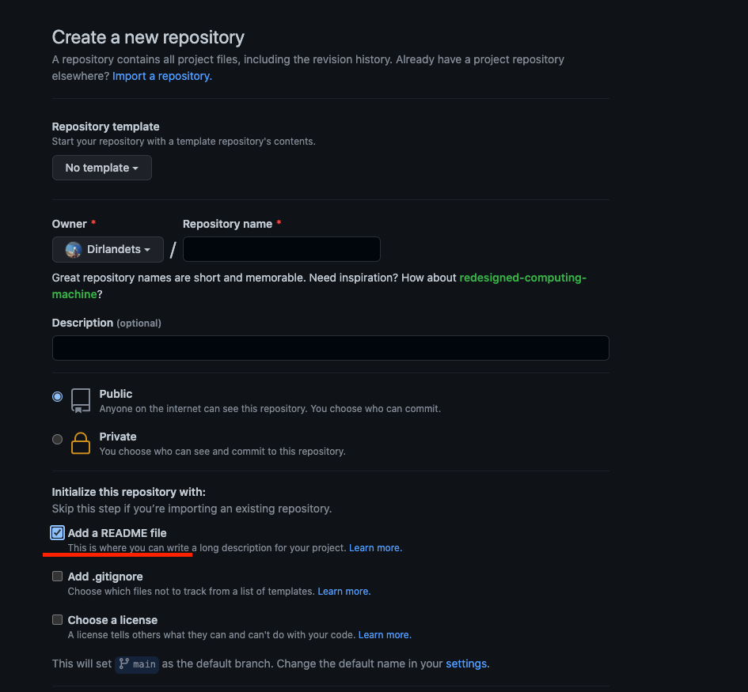
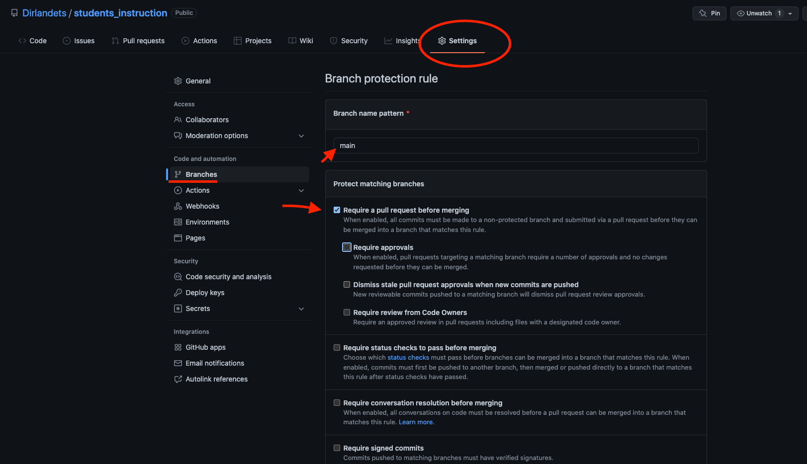
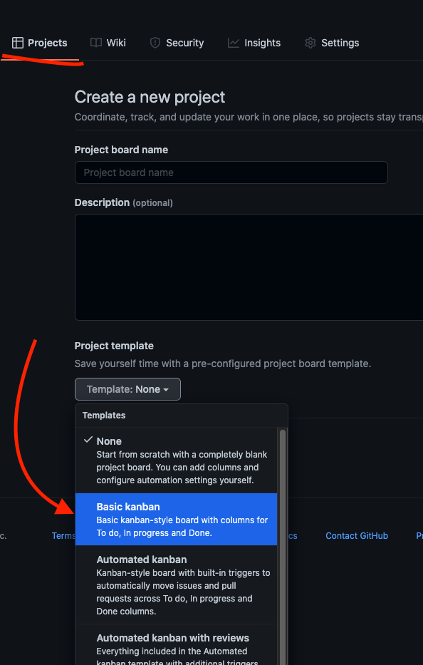

# Инструкция по созданию нового проекта

Всем нужно создать новый репозиторий с понятным названием. Придумать название не всегда просто но надо постараться.

Репозиторий можно сразу инициализировать с пустым `README.md` (При создании репозитория нужно ткнуть галочку)

## После создания репозитория:
* Пригласите меня контрибьюьором @Dirlandets
* Пригласите совего напарника контрибьютором (если напарник есть)
* Настройте репозиторий по инструкции

## Запрещаем пушить в ветку main
Пушить изменения сразу в ветку `main` очень плохая практика, особенно временные изменения или "что то что потом доделаю". Легко потерять свои изменения или затереть изменения которые внес напарник, чаще придется иметь дело с несогласованными конфликтаими.

Это важно в первую очередь для тех кто работает в комманде, но одиночек тоже не раз спасет.

> Любопытненткие могут изучить разделы Webhooks, Pages.
> При помощи webhooks можно например попробовать настроить оповещения в телеграмм о новых Pull Requests

Сливать свой код в мастер из pull request без аппрува напарника или куратора запрещено! :) Учимся работать в комманде.

### Команды git которые пригодятся:
* `git status` - посмотреть, что добавленно в коммит, что нет
* `git checkout -b feature/my_feature` - Создать новую ветку: 
* `git branch` - Посмотреть ветки (Звездочкой будет отмечена активная)
* `git checkout another_branch_name` - Переключаемся между ветками(Звездочкой будет отмечена активная)
* `git add filename` или `git add .` - Добавить файлы к коммиту
* `git commit -m "Commit text"` - Добавить описание коммита
* `git push` - запушить все коммиты в репозиторий
*  `git pull` - забрать из репозитория изменения

## Переносим в README.md описание вашего проекта.
README.md лицо любого проекта на github, здесь нужно написать что у вас за проект какие у него фичи, за основу можно взять этот фаил который вы прямо сейчас читаете, и вооружиться помощью [Markdown Cheatsheet](https://github.com/adam-p/markdown-here/wiki/Markdown-Cheatsheet)

На начальном этапе пишем:
* Краткое описание своего проекта
* Какую проблему решает
* Какие технологии планируете использовать
* Какие фичипланируете реализовать обязательно
* Какие доп фичи планируете

Фичи можно сразу сделать в виде TODOLIST

## Добавляем информацию о лицензии
[Что таое лицензия MIT](https://ru.wikipedia.org/wiki/%D0%9B%D0%B8%D1%86%D0%B5%D0%BD%D0%B7%D0%B8%D1%8F_MIT)
Copyright <YEAR> <COPYRIGHT HOLDER>

Permission is hereby granted, free of charge, to any person obtaining a copy of this software and associated documentation files (the "Software"), to deal in the Software without restriction, including without limitation the rights to use, copy, modify, merge, publish, distribute, sublicense, and/or sell copies of the Software, and to permit persons to whom the Software is furnished to do so, subject to the following conditions:

The above copyright notice and this permission notice shall be included in all copies or substantial portions of the Software.

THE SOFTWARE IS PROVIDED "AS IS", WITHOUT WARRANTY OF ANY KIND, EXPRESS OR IMPLIED, INCLUDING BUT NOT LIMITED TO THE WARRANTIES OF MERCHANTABILITY, FITNESS FOR A PARTICULAR PURPOSE AND NONINFRINGEMENT. IN NO EVENT SHALL THE AUTHORS OR COPYRIGHT HOLDERS BE LIABLE FOR ANY CLAIM, DAMAGES OR OTHER LIABILITY, WHETHER IN AN ACTION OF CONTRACT, TORT OR OTHERWISE, ARISING FROM, OUT OF OR IN CONNECTION WITH THE SOFTWARE OR THE USE OR OTHER DEALINGS IN THE SOFTWARE.

## Создаем доску с задачами
Доска может быть сторонней например Notion или Trello.

Или созданна прямо в github (Мне этот вариант нравится больше всего)

Получится простая доска, интегрированная с github. Через которую сразу можно создавать новые issue и привязывать их к конкретному члену комманды. 

Поиграйтесь с дефолтной доской там сразу идут хорошие примеры.

